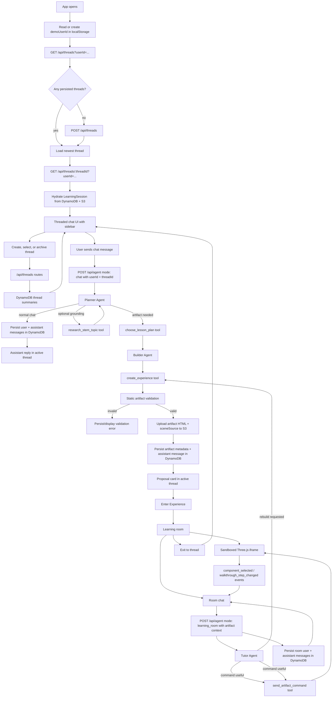
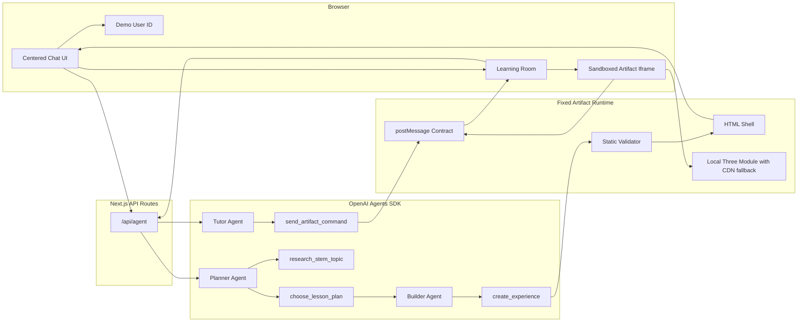

# Parallax Architecture


Parallax is a chat-first STEM learning app. OpenAI Agents SDK agents split the work into lesson planning, artifact building, and in-room tutoring. The Planner chooses the best lesson mode and can optionally ground niche or source-specific topics with Exa; the Builder creates a sandboxed Three.js artifact from that plan; the Tutor answers questions and controls the active learning room through tools.

Parallax is deployed as a Next.js app on Vercel. The browser talks only to Vercel-hosted API routes; AWS credentials stay server-side in Vercel environment variables. DynamoDB stores chat thread state and artifact metadata, while S3 stores generated artifact payloads.

## Product Flow



## Runtime Boundaries



## Deployed Infrastructure

| Service | Responsibility | Runtime Access |
| --- | --- | --- |
| Vercel | Hosts the Next.js app, React client bundle, and API routes. | Browser and serverless functions |
| Vercel Functions | Runs `/api/agent`, `/api/threads`, and `/api/threads/[threadId]`. | Server-side only |
| Amazon DynamoDB | Stores thread summaries, messages, and artifact metadata. | Vercel API routes |
| Amazon S3 | Stores generated artifact `html` and `sceneSource` payloads. | Vercel API routes |
| AWS IAM | Provides scoped access keys for Vercel functions. | Vercel environment variables |
| OpenAI Agents SDK | Runs the Planner, Builder, and Tutor agents for lesson planning, artifact generation, and room control. | Vercel API routes |


## Persistence Flow

### First Page Load

1. Browser creates or reads `parallax.demoUserId` from localStorage.
2. Browser calls `GET /api/threads?userId=<demo-user-id>`.
3. Vercel function reads DynamoDB thread summaries for `USER#<demo-user-id>`.
4. If no thread exists, the browser calls `POST /api/threads` to create one.
5. Browser loads the newest thread with `GET /api/threads/<threadId>?userId=<demo-user-id>`.

### Main Chat Message

1. Browser posts to `POST /api/agent` with `mode: "chat"`, `userId`, `threadId`, and message history.
2. Vercel function runs the Planner Agent with `research_stem_topic` and `choose_lesson_plan`.
3. For normal chat, the Planner answers directly and the route writes user and assistant messages to DynamoDB.
4. For an artifact request, the Planner chooses a `lessonMode`, writes a structured lesson plan, and optionally uses Exa through `research_stem_topic` for niche, current, patent, paper, product, or source-specific topics.
5. Vercel function runs the Builder Agent with the lesson plan and `create_experience`.
6. If artifact validation fails, the route persists/displays an assistant error message.
7. If validation succeeds, the route writes the user message to DynamoDB, uploads artifact `html` and `sceneSource` to S3, writes artifact metadata to DynamoDB, and writes the assistant message with `artifactId` to DynamoDB.

### Learning Room Message

1. Browser posts to `POST /api/agent` with `mode: "learning_room"`, active artifact context, `userId`, and `threadId`.
2. Vercel function runs the Tutor Agent with room-control tools and active artifact context, including `lessonMode`, `interactionGoal`, `controls`, `sources`, components, walkthrough steps, selected component, active step, and `sceneSource`.
3. Assistant text, safe progress trace events, and any artifact commands return to the browser over the same SSE stream. Trace events summarize agent updates, reasoning-item milestones, and tool execution without exposing hidden chain-of-thought or large tool arguments.
4. If the learner asks to rebuild or patch the scene, the Tutor creates a complete replacement artifact with `create_experience`; the browser switches the active room to that new artifact.
5. User and assistant learning-room messages are persisted to DynamoDB with the relevant `artifactId`.

### Thread Switching

1. Browser calls `GET /api/threads/<threadId>?userId=<demo-user-id>`.
2. Vercel function validates the user owns the thread summary.
3. Messages load from DynamoDB.
4. Artifact metadata loads from DynamoDB.
5. Artifact payloads load from S3.
6. The API converts persisted data back into the active `LearningSession` shape.

## Agent API Contract

The app has one agent endpoint: `POST /api/agent`.

When `stream: true` or `Accept: text/event-stream` is used, the endpoint emits `status`, `trace`, `delta`, `error`, and `done` SSE events. `trace` events are UI-safe progress entries for agent/tool activity; final user-facing text still arrives through `delta` and `done`.

Main chat sends:

```json
{
  "mode": "chat",
  "message": "Teach me jet engines",
  "messages": []
}
```

Learning room chat sends:

```json
{
  "mode": "learning_room",
  "message": "Focus the combustor",
  "artifact": {},
  "messages": [],
  "selectedComponent": null,
  "activeStepId": "intro"
}
```

The route uses different agent roles based on mode:

- **Planner Agent**: runs first in main chat. It decides whether an artifact is needed, whether Exa grounding is useful, and which lesson mode best fits the request.
- **Builder Agent**: runs only when the Planner chooses an artifact. It receives the structured lesson plan and must call `create_experience`.
- **Tutor Agent**: runs in learning-room mode. It receives active artifact context and may call `send_artifact_command`. For explicit rebuild or patch requests, it may also call `create_experience` to create a complete replacement artifact.

Main chat tools:

- `research_stem_topic`: optional Exa-backed source grounding for niche, current, patent, paper, product, or source-specific topics.
- `choose_lesson_plan`: structured Planner handoff with `artifactNeeded`, `lessonMode`, `interactionGoal`, `sources`, `requiredComponents`, and `builderBrief`.
- `create_experience`: structured Builder handoff with artifact metadata, generated scene code, components, walkthrough steps, and optional controls.

Learning-room tools:

- `send_artifact_command`: emits typed artifact commands such as `focus_component`, `go_to_step`, `explode`, `collapse`, `reset_camera`, and `toggle_labels`.
- `create_experience`: available for explicit rebuild or patch requests. It creates a replacement artifact; the app still does not support in-place scene editing.

Main chat also includes latest artifact context when available, so rebuild follow-ups like "fix that scene" can be planned as replacement artifacts.

Tool parameter schemas are also part of the API boundary. Keep them within the JSON Schema subset accepted by OpenAI tool validation. When adding fields, preserve the existing normalization pattern: OpenAI-facing schemas can use nullable values where the SDK expects them, then route/tool code normalizes to the internal optional shape.

## Artifact Contract

The model does not generate the whole page. The Builder generates `sceneSource` JavaScript plus structured metadata through `create_experience`. The fixed runtime wraps that source in the app-owned HTML shell, injects safe globals, renders labels/chrome, and owns the parent/iframe bridge.

The artifact metadata shape is:

```txt
topic
title
summary
lessonMode = playground | guided_walkthrough
interactionGoal?
sources?
controls?
sceneSource
components
walkthroughSteps
learningOutcomes?
```

The fixed runtime provides:

- `THREE`, `scene`, `camera`, `renderer`, `root`, and `controls`
- `registerComponent(id, label, object3D, metadata)`
- `registerControl(descriptor, callback)` and alias `control(...)`
- `setWalkthroughSteps(steps)`
- `setStatus(message)`
- `fitCameraTo(object3D, position?)`

`lessonMode` decides which teaching surface the artifact gets:

- `playground`: for cause-and-effect exploration where the learner should manipulate variables. It must declare one or more `controls`, call `registerControl` for each declared control, and use an empty `walkthroughSteps` array. The runtime renders playground sliders/toggles inside the iframe and hides walkthrough buttons.
- `guided_walkthrough`: for ordered systems, spatial tours, processes, or mechanisms. It must include walkthrough steps and must not declare controls or call `registerControl`. The runtime renders the walkthrough controls inside the iframe.

The validator rejects network calls, dynamic imports, markup injection, oversized code, JavaScript syntax errors, scenes without at least three registered components, missing `setWalkthroughSteps` calls, metadata component ids that are not registered in source, and any mode-rule violation. For playground artifacts, it also rejects missing `registerControl` calls, controls registered under undeclared ids, and declared controls that are never registered.

## Message Contract

Artifacts post events to the parent:

- `artifact_ready`
- `component_selected`
- `walkthrough_step_changed`
- `artifact_error`

The parent sends commands back:

- `focus_component`
- `go_to_step`
- `start_walkthrough`
- `pause_walkthrough`
- `reset_camera`
- `explode`
- `collapse`
- `toggle_labels`

`go_to_step`, `start_walkthrough`, and `pause_walkthrough` are mainly useful for `guided_walkthrough` artifacts. `playground` artifacts are usually controlled by runtime-rendered sliders/toggles plus Tutor explanations and component focus commands.

## DynamoDB Table

Use one table:

```txt
Table name: parallax-hackathon-threads
Partition key: PK
Partition key type: String
Sort key: SK
Sort key type: String
Billing mode: On-demand
```

Thread summary:

```txt
PK = USER#<userId>
SK = THREAD#<threadId>
entityType = thread
```

Message:

```txt
PK = THREAD#<threadId>
SK = MESSAGE#<createdAt>#<messageId>
entityType = message
```

Artifact metadata:

```txt
PK = THREAD#<threadId>
SK = ARTIFACT#<artifactId>
entityType = artifact
htmlS3Key = artifacts/<threadId>/<artifactId>/index.html
sceneSourceS3Key = artifacts/<threadId>/<artifactId>/scene.js
lessonMode = playground | guided_walkthrough
interactionGoal?
sources?
controls?
components
walkthroughSteps
learningOutcomes?
```

## S3 Bucket

Use one private bucket:

```txt
Bucket name: parallax-hackathon-artifacts-<account-id>
Public access: blocked
Object prefix: artifacts/
```

Stored objects:

```txt
artifacts/<threadId>/<artifactId>/index.html
artifacts/<threadId>/<artifactId>/scene.js
```

The bucket does not need public read access. The app reads artifacts through the server-side AWS SDK and returns hydrated thread data through the Vercel API.

## Environment Variables

Set these in Vercel Project Settings and locally in `.env.local`:

```bash
OPENAI_API_KEY=
OPENAI_MODEL=gpt-5.4
EXA_API_KEY=

AWS_ACCESS_KEY_ID=
AWS_SECRET_ACCESS_KEY=
AWS_REGION=us-west-2

PARALLAX_THREADS_TABLE=parallax-hackathon-threads
PARALLAX_ARTIFACT_BUCKET=parallax-hackathon-artifacts-<account-id>
```

Use the AWS region where the table and bucket were created. For the event workshop account shown in the AWS console, Oregon means:

```bash
AWS_REGION=us-west-2
```

Do not prefix AWS variables with `NEXT_PUBLIC_`; the browser must never receive AWS credentials.

## IAM Policy

The scoped IAM user for Vercel only needs DynamoDB access to the one table and S3 access to the artifact prefix.

```json
{
  "Version": "2012-10-17",
  "Statement": [
    {
      "Effect": "Allow",
      "Action": [
        "dynamodb:GetItem",
        "dynamodb:PutItem",
        "dynamodb:UpdateItem",
        "dynamodb:Query"
      ],
      "Resource": "arn:aws:dynamodb:us-west-2:<account-id>:table/parallax-hackathon-threads"
    },
    {
      "Effect": "Allow",
      "Action": [
        "s3:GetObject",
        "s3:PutObject"
      ],
      "Resource": "arn:aws:s3:::parallax-hackathon-artifacts-<account-id>/artifacts/*"
    }
  ]
}
```

If the AWS resources are in a different region, update the DynamoDB ARN region and `AWS_REGION`.

## Manual AWS Setup

Create the DynamoDB table:

```bash
aws dynamodb create-table \
  --table-name parallax-hackathon-threads \
  --attribute-definitions AttributeName=PK,AttributeType=S AttributeName=SK,AttributeType=S \
  --key-schema AttributeName=PK,KeyType=HASH AttributeName=SK,KeyType=RANGE \
  --billing-mode PAY_PER_REQUEST \
  --region us-west-2
```

Create the S3 bucket:

```bash
AWS_ACCOUNT_ID=$(aws sts get-caller-identity --query Account --output text)
ARTIFACT_BUCKET="parallax-hackathon-artifacts-${AWS_ACCOUNT_ID}"

aws s3 mb "s3://${ARTIFACT_BUCKET}" --region us-west-2

aws s3api put-public-access-block \
  --bucket "${ARTIFACT_BUCKET}" \
  --public-access-block-configuration BlockPublicAcls=true,IgnorePublicAcls=true,BlockPublicPolicy=true,RestrictPublicBuckets=true
```

## Deployment Checklist

- DynamoDB table exists with `PK` and `SK` string keys.
- S3 bucket exists in the same region as `AWS_REGION`.
- S3 public access block is enabled.
- IAM access key belongs to the scoped IAM user.
- Vercel env vars are set for Production, Preview, and Development as needed.
- Vercel deployment has been redeployed after env vars changed.
- Local `.env.local` has the same non-public env vars for local testing.

## Operational Notes

- The demo identity is localStorage-based, not real auth.
- The workshop AWS account and IAM keys may expire after the event.
- There is no CloudFront layer because artifacts are loaded through server-side S3 reads, not public URLs.
- There is no queue or async worker; artifact persistence happens inline during the `/api/agent` request.
- There is no global secondary index yet; the current single-table access pattern supports the hackathon thread list and thread load flows.

## Key Decisions

- **Canvas-left learning room**: the artifact is the main stage; chat is contextual support.
- **Proposal first**: the user sees the generated plan before entering.
- **One-shot artifacts**: v1 creates the best complete experience in one pass. Rebuild and patch requests create a new complete replacement artifact instead of editing an artifact in place.
- **Sandboxed iframe**: generated code runs in an iframe with a strict `postMessage` bridge.
- **Fixed runtime, generated scene**: the app owns labels, chrome, mode-aware controls, walkthrough UI, and validation.
- **Adaptive lesson modes**: the Planner chooses between `playground` and `guided_walkthrough` instead of forcing every topic into a walkthrough.
- **Planner, Builder, Tutor orchestration**: planning, artifact construction, and in-room teaching are separate Agents SDK roles with narrow tools.
- **Planner-selected grounding**: Exa research is available to the Planner for patents, papers, current, niche, or source-specific topics, but ordinary STEM requests can proceed from model knowledge.
- **Single agent endpoint**: `/api/agent` accepts a mode-discriminated payload instead of separate mode-specific routes.
- **AWS-backed thread persistence**: DynamoDB stores thread summaries, messages, and artifact metadata; S3 stores generated artifact payloads.

## References

- [Vercel Environment Variables](https://vercel.com/docs/environment-variables)
- [Iconify](https://iconify.design/)
- [Shields.io badges](https://shields.io/)
- [Simple Icons](https://simpleicons.org/)
