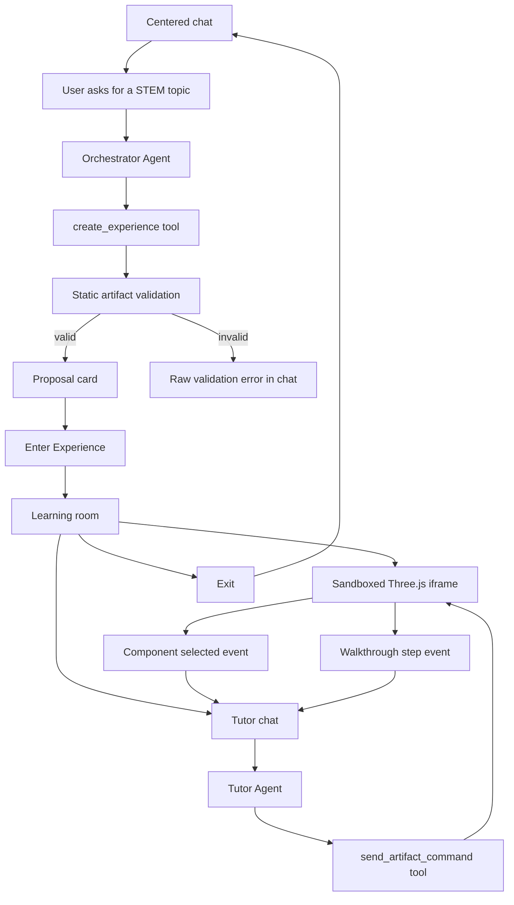

# Parallax Architecture

Parallax is a chat-first STEM learning app. A user asks for a topic, the OpenAI Agents SDK Orchestrator generates a sandboxed Three.js artifact, and the user enters a learning room with the canvas on the left and tutor chat on the right.

## Product Flow



## Runtime Boundaries

```mermaid
flowchart LR
  subgraph Browser
    Chat[Centered Chat UI]
    Room[Learning Room]
    Frame[Sandboxed Artifact Iframe]
    Store[LocalStorage Session]
  end

  subgraph NextRoutes[Next.js API Routes]
    ChatAPI[/api/agent/chat]
    TutorAPI[/api/agent/tutor]
  end

  subgraph Agents[OpenAI Agents SDK]
    Orchestrator[Orchestrator Agent]
    Tutor[Tutor Agent]
    CreateTool[create_experience]
    CommandTool[send_artifact_command]
  end

  subgraph ArtifactRuntime[Fixed Artifact Runtime]
    Template[HTML Shell]
    Validator[Static Validator]
    Three[Local Three Module with CDN fallback]
    Bridge[postMessage Contract]
  end

  Chat --> ChatAPI
  Chat --> Store
  ChatAPI --> Orchestrator
  Orchestrator --> CreateTool
  CreateTool --> Validator
  Validator --> Template
  Template --> Chat
  Chat --> Room
  Room --> Frame
  Frame --> Three
  Frame --> Bridge
  Bridge --> Room
  Room --> TutorAPI
  TutorAPI --> Tutor
  Tutor --> CommandTool
  CommandTool --> Bridge
```

## Artifact Contract

The model does not generate the whole page. It generates `sceneSource` JavaScript plus metadata. The fixed runtime provides:

- `THREE`, `scene`, `camera`, `renderer`, `root`, and `controls`
- `registerComponent(id, label, object3D, metadata)`
- `setWalkthroughSteps(steps)`
- `setStatus(message)`
- `fitCameraTo(object3D, position?)`

The validator rejects network calls, dynamic imports, markup injection, oversized code, scenes without at least three registered components, and scenes without walkthrough steps.

## Message Contract

Artifacts post events to the parent:

- `artifact_ready`
- `component_selected`
- `walkthrough_step_changed`
- `artifact_error`

The parent sends commands back:

- `focus_component`
- `go_to_step`
- `start_walkthrough`
- `pause_walkthrough`
- `reset_camera`
- `explode`
- `collapse`
- `toggle_labels`

## Key Decisions

- **Canvas-left learning room**: the artifact is the main stage; chat is contextual support.
- **Proposal first**: the user sees the generated plan before entering.
- **One-shot artifacts**: v1 creates the best complete experience in one pass instead of editing artifacts in place.
- **Sandboxed iframe**: generated code runs in an iframe with a strict `postMessage` bridge.
- **Fixed runtime, generated scene**: the app owns controls, labels, walkthrough UI, and validation.
- **OpenAI Agents SDK**: Next.js routes host the Orchestrator and Tutor agents with explicit tools.
- **Local persistence**: browser storage keeps the chat, generated artifacts, and room state available after refresh.
