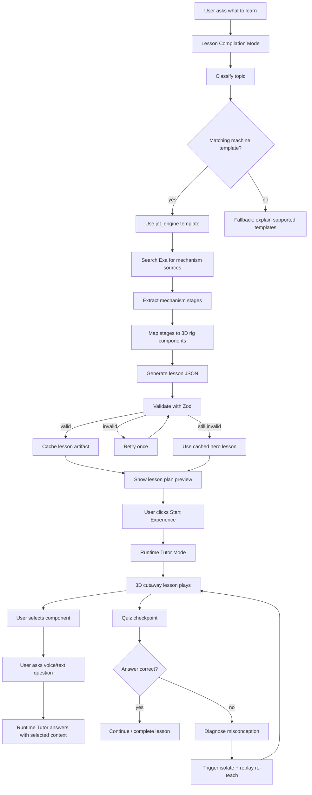
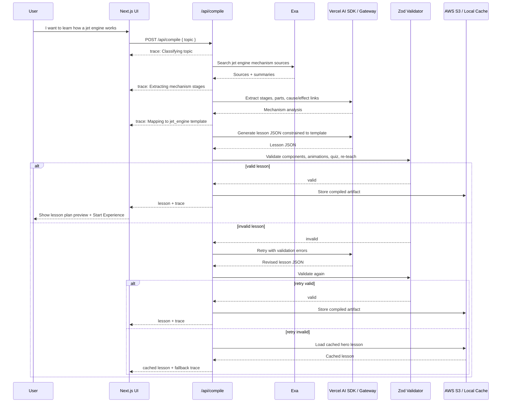
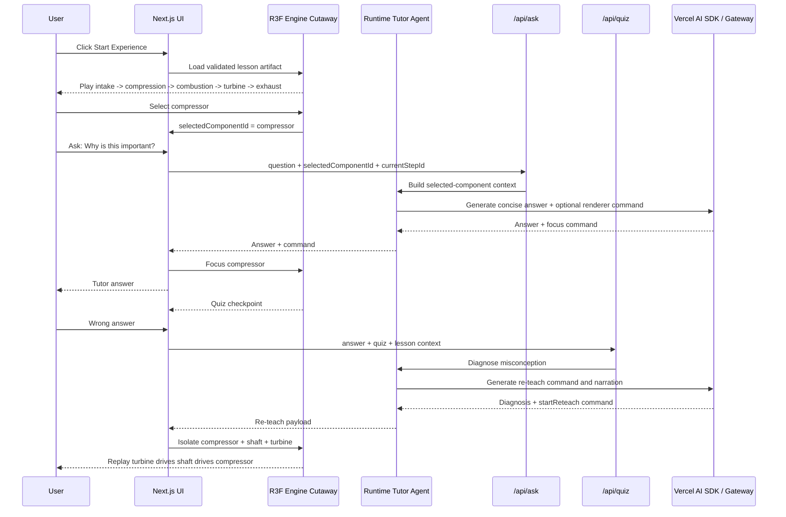
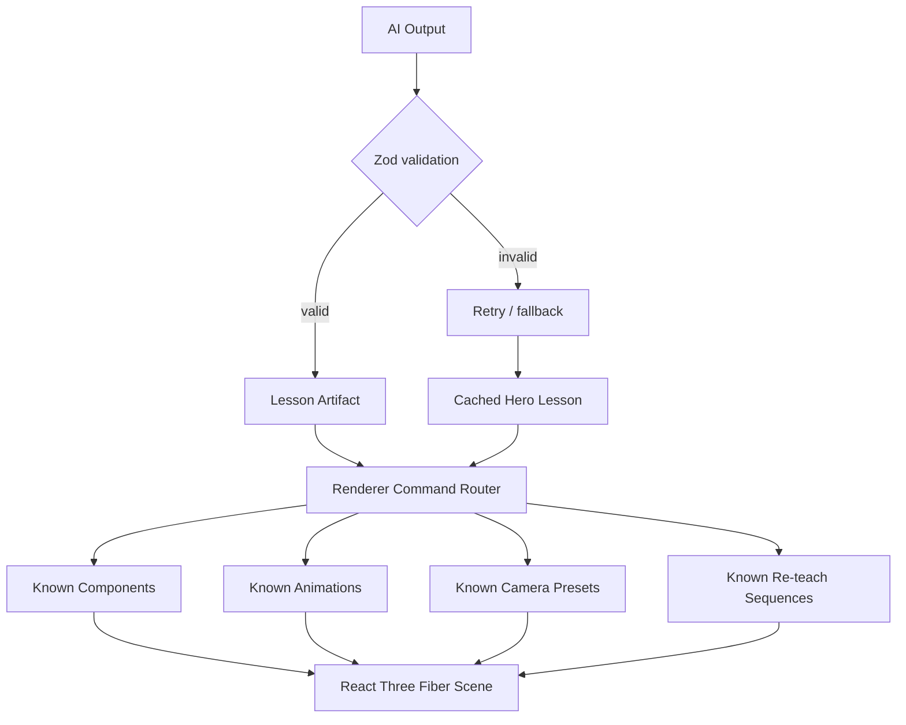

# Parallax Architecture

Parallax is split into two product modes:

1. **Lesson Compilation Mode**: the user asks what they want to learn, and the Lesson Compiler turns that request into a validated lesson artifact.
2. **Runtime Tutor Mode**: the user enters the interactive 3D cutaway experience, where the Runtime Tutor answers questions, observes selections, quizzes, and re-teaches.

## Product Flow




## System Architecture

```mermaid
flowchart LR
  subgraph Browser[Browser / Vercel Frontend]
    UI[Next.js UI]
    Canvas[React Three Fiber Jet Engine Cutaway]
    Panel[Agent Panel]
    Voice[Push-to-talk Voice + Text Fallback]
    Mouse[Mouse / Touch Selection]
    Hand[Optional MediaPipe Hand Input]
  end

  subgraph Runtime[Runtime Tutor Layer]
    AskAPI[/api/ask]
    QuizAPI[/api/quiz]
    Tutor[Runtime Tutor Agent]
  end

  subgraph Compile[Lesson Compilation Layer]
    CompileAPI[/api/compile]
    Compiler[Lesson Compiler v1]
    Schema[Zod Lesson Schema]
    Trace[Compiler Trace Events]
  end

  subgraph Services[Sponsor / Cloud Services]
    Exa[Exa Search]
    Gateway[Vercel AI SDK / AI Gateway]
    S3[AWS S3 Lesson Cache]
    Polly[Optional AWS Polly TTS]
  end

  UI --> Panel
  UI --> Canvas
  Voice --> Panel
  Mouse --> Canvas
  Hand --> Canvas
  Canvas --> Panel

  Panel --> CompileAPI
  CompileAPI --> Compiler
  Compiler --> Exa
  Compiler --> Gateway
  Compiler --> Schema
  Compiler --> Trace
  Compiler --> S3
  Schema --> CompileAPI
  Trace --> Panel
  S3 --> CompileAPI
  CompileAPI --> UI

  Panel --> AskAPI
  Panel --> QuizAPI
  AskAPI --> Tutor
  QuizAPI --> Tutor
  Tutor --> Gateway
  Tutor --> Canvas
  Tutor --> Panel
  Polly -. fallback .-> Panel
```


## Lesson Compilation Mode

The Lesson Compiler creates the teaching artifact before the interactive experience starts. For the hackathon MVP, this is a controlled compiler for the `jet_engine` template.




## Runtime Tutor Mode

Runtime Tutor Mode starts after the user clicks **Start Experience**. At this point, the app already has a validated lesson artifact, so the 3D experience can be smooth and deterministic.




## Boundary Between AI And Renderer

The AI never generates arbitrary Three.js code. It only generates validated lesson artifacts and renderer commands.




## Key Architectural Decisions

- **Two agent layers**: Lesson Compiler for 0-to-1 generation, Runtime Tutor for live interaction.
- **Template-first generation**: the MVP compiles lessons for a fixed `jet_engine` rig instead of generating arbitrary 3D scenes.
- **Validated lesson artifact**: the compiler outputs JSON, not code.
- **Deterministic 3D renderer**: React Three Fiber owns geometry, positions, hitboxes, animations, and camera presets.
- **Visible trace**: compilation logs are shown to judges so the agentic work is inspectable.
- **Hybrid reliability**: Exa is used live, but cached lesson fallback keeps the demo safe.
- **Input abstraction**: mouse, touch, and optional MediaPipe all emit the same component-selection events.

