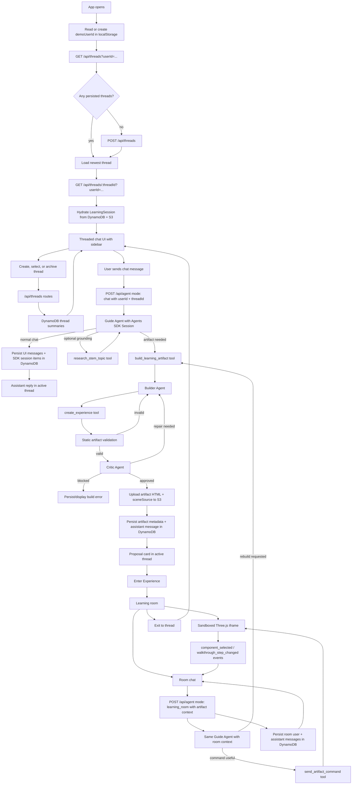
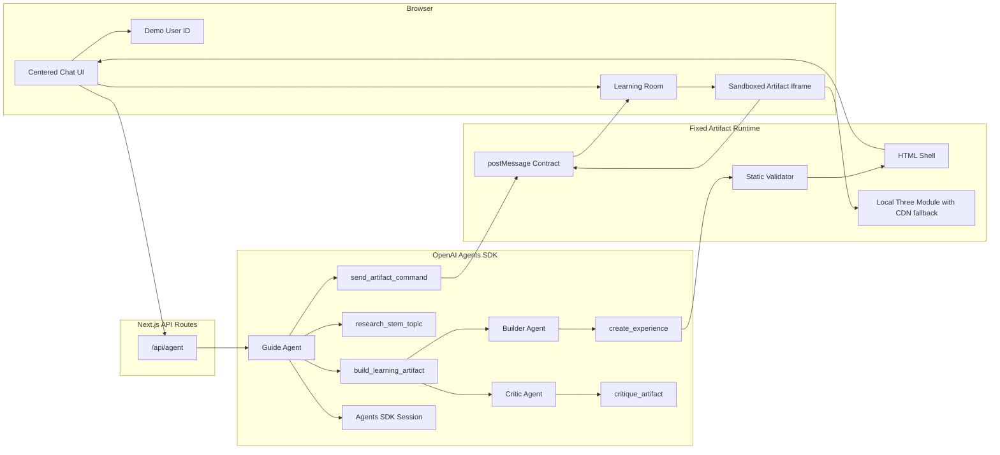

# Parallax Architecture


Parallax is a chat-first STEM learning app. A single user-facing OpenAI Agents SDK Guide Agent owns the live conversation across the normal chat surface and the learning room. The Guide can answer directly, ground niche or source-specific topics with Exa, command the active artifact, or call a hidden artifact-building workflow. That workflow runs Builder and Critic agents behind a `build_learning_artifact` tool, validates the sandboxed Three.js artifact, and returns a complete replacement artifact when needed.

Parallax is deployed as a Next.js app on Vercel. The browser talks only to Vercel-hosted API routes; AWS credentials stay server-side in Vercel environment variables. DynamoDB stores chat thread state and artifact metadata, while S3 stores generated artifact payloads.

## Product Flow



## Runtime Boundaries



## Deployed Infrastructure

| Service | Responsibility | Runtime Access |
| --- | --- | --- |
| Vercel | Hosts the Next.js app, React client bundle, and API routes. | Browser and serverless functions |
| Vercel Functions | Runs `/api/agent`, `/api/threads`, and `/api/threads/[threadId]`. | Server-side only |
| Amazon DynamoDB | Stores thread summaries, messages, and artifact metadata. | Vercel API routes |
| Amazon S3 | Stores generated artifact `html` and `sceneSource` payloads. | Vercel API routes |
| AWS IAM | Provides scoped access keys for Vercel functions. | Vercel environment variables |
| In-memory thread store | Temporary fallback when AWS storage is unconfigured or AWS credentials/resources are unavailable. | Vercel function runtime only |
| OpenAI Agents SDK | Runs the Guide agent for live conversation, plus hidden Builder/Critic workers for artifact generation and QA. | Vercel API routes |

AWS remains the durable persistence layer. After the hackathon/workshop AWS credits and scoped keys expired, the API routes were updated to wrap DynamoDB/S3 with a resilient thread store. If AWS configuration is missing, or if AWS returns credential/service errors such as expired token, access denied, missing key, or missing resource, `getThreadStore()` falls back to an in-memory implementation for that function runtime. This keeps `/api/threads` and `/api/agent` usable instead of returning 500s, but data written during fallback is not durable and previous DynamoDB/S3 history is unavailable until AWS access is restored or replaced.


## Persistence Flow

### First Page Load

1. Browser creates or reads `parallax.demoUserId` from localStorage.
2. Browser calls `GET /api/threads?userId=<demo-user-id>`.
3. Vercel function reads DynamoDB thread summaries for `USER#<demo-user-id>`, or uses the in-memory fallback if AWS storage is unavailable.
4. If no thread exists, the browser calls `POST /api/threads` to create one.
5. Browser loads the newest thread with `GET /api/threads/<threadId>?userId=<demo-user-id>`.

### Main Chat Message

1. Browser posts to `POST /api/agent` with `mode: "chat"`, `userId`, `threadId`, and message history.
2. Vercel function runs the Guide Agent with an Agents SDK `Session` backed by the thread.
3. For normal chat, the Guide answers directly. The route writes user-visible messages to DynamoDB, while the SDK session adapter stores model conversation items under the same thread partition.
4. For an artifact request, the Guide calls `build_learning_artifact` with a complete lesson plan and may use Exa through `research_stem_topic` for niche, current, patent, paper, product, or source-specific topics.
5. The `build_learning_artifact` tool runs the Builder Agent with `create_experience`, repairs once from validator feedback when possible, then runs the Critic Agent with `critique_artifact` and repairs once from critic feedback when needed.
6. If the artifact remains invalid or unapproved, the route persists/displays an assistant error message.
7. If validation and critique succeed, the route writes the user message to DynamoDB, uploads artifact `html` and `sceneSource` to S3, writes artifact metadata to DynamoDB, and writes the assistant message with `artifactId` to DynamoDB.

### Learning Room Message

1. Browser posts to `POST /api/agent` with `mode: "learning_room"`, active artifact context, `userId`, and `threadId`.
2. Vercel function runs the same Guide Agent with room-control tools and active artifact context, including `lessonMode`, `interactionGoal`, `controls`, `sources`, components, walkthrough steps, selected component, active step, and `sceneSource`.
3. Assistant text, safe progress trace events, and any artifact commands return to the browser over the same SSE stream. Trace events summarize agent updates, reasoning-item milestones, and tool execution without exposing hidden chain-of-thought or large tool arguments.
4. If the learner asks to rebuild or patch the scene, the Guide calls `build_learning_artifact` to create a complete replacement artifact; the browser switches the active room to that new artifact.
5. User and assistant learning-room messages are persisted to DynamoDB with the relevant `artifactId`, and the Agents SDK session adapter stores conversation history under the same thread.

### Thread Switching

1. Browser calls `GET /api/threads/<threadId>?userId=<demo-user-id>`.
2. Vercel function validates the user owns the thread summary.
3. Messages load from DynamoDB.
4. Artifact metadata loads from DynamoDB.
5. Artifact payloads load from S3.
6. The API converts persisted data back into the active `LearningSession` shape.

## Agent API Contract

The app has one agent endpoint: `POST /api/agent`.

When `stream: true` or `Accept: text/event-stream` is used, the endpoint emits `status`, `trace`, `delta`, `error`, and `done` SSE events. `trace` events are UI-safe progress entries for agent/tool activity; final user-facing text still arrives through `delta` and `done`.

Main chat sends:

```json
{
  "mode": "chat",
  "message": "Teach me jet engines",
  "messages": []
}
```

Learning room chat sends:

```json
{
  "mode": "learning_room",
  "message": "Focus the combustor",
  "artifact": {},
  "messages": [],
  "selectedComponent": null,
  "activeStepId": "intro"
}
```

Both payloads are handled by the **Guide Agent**. `mode` is UI context only: it tells the Guide whether an artifact is visible and which room state the user is looking at. It does not select a separate Planner or Tutor agent.

- `research_stem_topic`: optional Exa-backed source grounding for niche, current, patent, paper, product, or source-specific topics.
- `build_learning_artifact`: hidden artifact workflow. The Guide supplies a lesson plan; the tool runs Builder and Critic agents, validates the artifact contract, and returns either a complete artifact or an error.
- `send_artifact_command`: emits typed artifact commands such as `focus_component`, `go_to_step`, `explode`, `collapse`, `reset_camera`, and `toggle_labels`.

The Builder Agent still uses the lower-level `create_experience` tool inside `build_learning_artifact`. The Critic Agent uses `critique_artifact` inside the same workflow. These lower-level tools are not exposed to the user-facing Guide as direct routing modes.

Main chat also includes latest artifact context when available, so rebuild follow-ups like "fix that scene" can be planned as replacement artifacts. The app still does not support in-place scene editing.

Tool parameter schemas are also part of the API boundary. Keep them within the JSON Schema subset accepted by OpenAI tool validation. When adding fields, preserve the existing normalization pattern: OpenAI-facing schemas can use nullable values where the SDK expects them, then route/tool code normalizes to the internal optional shape.

## Artifact Contract

The model does not generate the whole page. The Builder generates `sceneSource` JavaScript plus structured metadata through `create_experience`. The fixed runtime wraps that source in the app-owned HTML shell, injects safe globals, renders labels/chrome, and owns the parent/iframe bridge.

The artifact metadata shape is:

```txt
topic
title
summary
lessonMode = playground | guided_walkthrough
interactionGoal?
sources?
controls?
sceneSource
components
walkthroughSteps
learningOutcomes?
```

The fixed runtime provides:

- `THREE`, `scene`, `camera`, `renderer`, `root`, and `controls`
- `registerComponent(id, label, object3D, metadata)`
- `registerControl(descriptor, callback)` and alias `control(...)`
- `setWalkthroughSteps(steps)`
- `setStatus(message)`
- `fitCameraTo(object3D, position?)`

`lessonMode` decides which teaching surface the artifact gets:

- `playground`: for cause-and-effect exploration where the learner should manipulate variables. It must declare one or more `controls`, call `registerControl` for each declared control, and use an empty `walkthroughSteps` array. The runtime renders playground sliders/toggles inside the iframe and hides walkthrough buttons.
- `guided_walkthrough`: for ordered systems, spatial tours, processes, or mechanisms. It must include walkthrough steps and must not declare controls or call `registerControl`. The runtime renders the walkthrough controls inside the iframe.

The validator rejects network calls, dynamic imports, markup injection, oversized code, JavaScript syntax errors, scenes without at least three registered components, missing `setWalkthroughSteps` calls, metadata component ids that are not registered in source, and any mode-rule violation. For playground artifacts, it also rejects missing `registerControl` calls, controls registered under undeclared ids, and declared controls that are never registered.

## Message Contract

Artifacts post events to the parent:

- `artifact_ready`
- `component_selected`
- `walkthrough_step_changed`
- `artifact_error`

The parent sends commands back:

- `focus_component`
- `go_to_step`
- `start_walkthrough`
- `pause_walkthrough`
- `reset_camera`
- `explode`
- `collapse`
- `toggle_labels`

`go_to_step`, `start_walkthrough`, and `pause_walkthrough` are mainly useful for `guided_walkthrough` artifacts. `playground` artifacts are usually controlled by runtime-rendered sliders/toggles plus Guide explanations and component focus commands.

## DynamoDB Table

Use one table:

```txt
Table name: parallax-hackathon-threads
Partition key: PK
Partition key type: String
Sort key: SK
Sort key type: String
Billing mode: On-demand
```

Thread summary:

```txt
PK = USER#<userId>
SK = THREAD#<threadId>
entityType = thread
```

Message:

```txt
PK = THREAD#<threadId>
SK = MESSAGE#<createdAt>#<messageId>
entityType = message
```

Artifact metadata:

```txt
PK = THREAD#<threadId>
SK = ARTIFACT#<artifactId>
entityType = artifact
htmlS3Key = artifacts/<threadId>/<artifactId>/index.html
sceneSourceS3Key = artifacts/<threadId>/<artifactId>/scene.js
lessonMode = playground | guided_walkthrough
interactionGoal?
sources?
controls?
components
walkthroughSteps
learningOutcomes?
```

Agents SDK session item:

```txt
PK = THREAD#<threadId>
SK = AGENT_SESSION#<createdAt>#<sequence>#<itemId>
entityType = agent_session_item
item = <AgentInputItem>
```

Session item reads validate the caller owns the thread summary first. The UI-visible chat transcript remains stored as `MESSAGE#...` records; SDK session items preserve the model-facing conversation history used by `run(..., { session })`.

## S3 Bucket

Use one private bucket:

```txt
Bucket name: parallax-hackathon-artifacts-<account-id>
Public access: blocked
Object prefix: artifacts/
```

Stored objects:

```txt
artifacts/<threadId>/<artifactId>/index.html
artifacts/<threadId>/<artifactId>/scene.js
```

The bucket does not need public read access. The app reads artifacts through the server-side AWS SDK and returns hydrated thread data through the Vercel API.

## Environment Variables

Set these in Vercel Project Settings and locally in `.env.local`:

```bash
OPENAI_API_KEY=
OPENAI_MODEL=gpt-5.4
EXA_API_KEY=

AWS_ACCESS_KEY_ID=
AWS_SECRET_ACCESS_KEY=
AWS_REGION=us-west-2

PARALLAX_THREADS_TABLE=parallax-hackathon-threads
PARALLAX_ARTIFACT_BUCKET=parallax-hackathon-artifacts-<account-id>
```

Use the AWS region where the table and bucket were created. For the event workshop account shown in the AWS console, Oregon means:

```bash
AWS_REGION=us-west-2
```

Do not prefix AWS variables with `NEXT_PUBLIC_`; the browser must never receive AWS credentials.

## IAM Policy

The scoped IAM user for Vercel only needs DynamoDB access to the one table and S3 access to the artifact prefix.

```json
{
  "Version": "2012-10-17",
  "Statement": [
    {
      "Effect": "Allow",
      "Action": [
        "dynamodb:DeleteItem",
        "dynamodb:GetItem",
        "dynamodb:PutItem",
        "dynamodb:UpdateItem",
        "dynamodb:Query"
      ],
      "Resource": "arn:aws:dynamodb:us-west-2:<account-id>:table/parallax-hackathon-threads"
    },
    {
      "Effect": "Allow",
      "Action": [
        "s3:GetObject",
        "s3:PutObject"
      ],
      "Resource": "arn:aws:s3:::parallax-hackathon-artifacts-<account-id>/artifacts/*"
    }
  ]
}
```

If the AWS resources are in a different region, update the DynamoDB ARN region and `AWS_REGION`.

## Manual AWS Setup

Create the DynamoDB table:

```bash
aws dynamodb create-table \
  --table-name parallax-hackathon-threads \
  --attribute-definitions AttributeName=PK,AttributeType=S AttributeName=SK,AttributeType=S \
  --key-schema AttributeName=PK,KeyType=HASH AttributeName=SK,KeyType=RANGE \
  --billing-mode PAY_PER_REQUEST \
  --region us-west-2
```

Create the S3 bucket:

```bash
AWS_ACCOUNT_ID=$(aws sts get-caller-identity --query Account --output text)
ARTIFACT_BUCKET="parallax-hackathon-artifacts-${AWS_ACCOUNT_ID}"

aws s3 mb "s3://${ARTIFACT_BUCKET}" --region us-west-2

aws s3api put-public-access-block \
  --bucket "${ARTIFACT_BUCKET}" \
  --public-access-block-configuration BlockPublicAcls=true,IgnorePublicAcls=true,BlockPublicPolicy=true,RestrictPublicBuckets=true
```

## Deployment Checklist

- DynamoDB table exists with `PK` and `SK` string keys.
- S3 bucket exists in the same region as `AWS_REGION`.
- S3 public access block is enabled.
- IAM access key belongs to the scoped IAM user.
- Vercel env vars are set for Production, Preview, and Development as needed.
- Vercel deployment has been redeployed after env vars changed.
- Local `.env.local` has the same non-public env vars for local testing.

## Operational Notes

- The demo identity is localStorage-based, not real auth.
- The workshop AWS account and IAM keys may expire after the event. When they do, Parallax falls back to in-memory thread storage so the demo can still run, but fallback state is temporary and can disappear between serverless runtime instances or deployments.
- There is no CloudFront layer because artifacts are loaded through server-side S3 reads, not public URLs.
- There is no queue or async worker; artifact persistence happens inline during the `/api/agent` request.
- There is no global secondary index yet; the current single-table access pattern supports the hackathon thread list and thread load flows.

## Key Decisions

- **Canvas-left learning room**: the artifact is the main stage; chat is contextual support.
- **Proposal first**: the user sees the generated plan before entering.
- **One-shot artifacts**: v1 creates the best complete experience in one pass. Rebuild and patch requests create a new complete replacement artifact instead of editing an artifact in place.
- **Sandboxed iframe**: generated code runs in an iframe with a strict `postMessage` bridge.
- **Fixed runtime, generated scene**: the app owns labels, chrome, mode-aware controls, walkthrough UI, and validation.
- **Adaptive lesson modes**: the Guide chooses between `playground` and `guided_walkthrough` inside its artifact plan instead of forcing every topic into a walkthrough.
- **Single user-facing Guide**: the Guide owns both chat and learning-room turns. `mode` remains in the payload for UI context, not for agent routing.
- **Hidden artifact workers**: Builder and Critic agents run only inside `build_learning_artifact`, keeping artifact generation and QA specialized without splitting the user's live conversation.
- **Guide-selected grounding**: Exa research is available to the Guide for patents, papers, current, niche, or source-specific topics, but ordinary STEM requests can proceed from model knowledge.
- **Agents SDK Sessions**: threaded requests pass a `ThreadAgentSession` into `run()` so model-facing history is persisted separately from UI messages.
- **Single agent endpoint**: `/api/agent` accepts a mode-discriminated payload instead of separate mode-specific routes.
- **AWS-backed thread persistence**: DynamoDB stores thread summaries, messages, and artifact metadata; S3 stores generated artifact payloads.

## References

- [Vercel Environment Variables](https://vercel.com/docs/environment-variables)
- [Iconify](https://iconify.design/)
- [Shields.io badges](https://shields.io/)
- [Simple Icons](https://simpleicons.org/)
